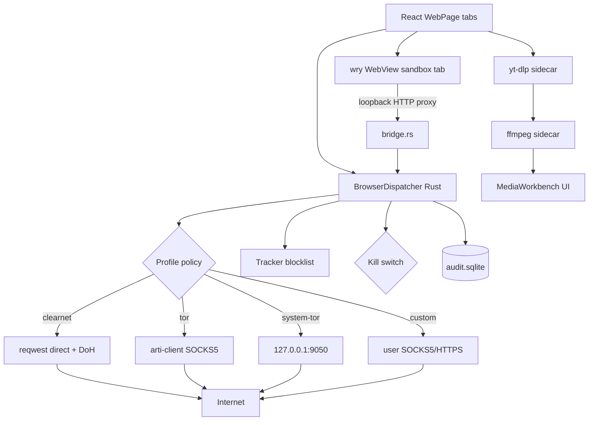

# Browser

This document is the source of truth for the Web module — its threat model,
architecture, the single-dispatcher invariant, how profiles work, what the
sandbox tabs do, how downloads + media + research slot together, and the
hard limits of the security story.

## 1. Threat model (explicit)

**In scope** — things the browser is designed to defend against:

| Threat | Primary mitigation |
|---|---|
| ISP / destination IP observation | `tor` profile (system Tor or arti feature), `custom` profile routes through user SOCKS5/HTTPS |
| DNS leaks on clearnet | DoH resolver choice (Cloudflare / Quad9 / Google); SOCKS5h on Tor/custom so names resolve inside the tunnel |
| Tracker / ad graph correlation | Built-in 18-host blocklist consulted before any socket opens; per-profile `block_trackers` flag |
| Browser-fingerprint correlation | Init-script pins WebGL vendor to Apple M2, canvas noise, timezone forced to UTC on Tor, `navigator.languages` locked, screen dims rounded |
| Third-party cookie tracking | `block_third_party_cookies` strips `Set-Cookie` where request-origin ≠ top-level origin; per-profile ephemeral or disabled jars |
| WebRTC real-IP leak | `RTCPeerConnection = undefined` in the init-script for `tor` and `private` profiles |
| Tab-to-tab state leakage | Each sandbox tab gets its own ephemeral `data_directory` under `~/Library/Application Support/sunny/wv/<profile>/<tab-uuid>`; deleted on close |
| Drive-by XSS / untrusted HTML eval | Reader mode is the default untrusted-content path: Rust sanitizes to a 15-tag allow-list; React parses via `DOMParser` (never `innerHTML`). Reader never runs JS |
| Credential exfil via bad extensions | We have no extensions, by design |
| Sensor abuse | `deny_sensors` stubs geolocation / camera / mic / MIDI / USB / Bluetooth / HID / serial in the init-script |
| "Something leaked" uncertainty | Audit log at `~/.sunny/browser/audit.sqlite` records every dispatch (host:port, sizes, timing, blocked-by). URL paths never stored |
| Operator panic / compromised account | Kill switch halts every dispatch immediately; profiles can opt out via `kill_switch_bypass` but built-ins don't |

**Out of scope** — things the browser explicitly does not claim to defend
against, and never will without a fresh threat model:

- macOS kernel or WKWebView zero-days (we ride Apple's patch cadence).
- The operator's Mac being already compromised (keyloggers, root malware).
- The destination server logging you after TLS decryption — that's their
  building to care about.
- GPU/timing/cache covert channels inside WKWebView.
- Strongly persistent adversaries who can correlate exit-node metadata
  across sessions. That's what Tor Browser with safer-level settings is
  for; we match what we can from within a Tauri app.

The UI must never claim otherwise. Badges say what the code actually
enforces, not what a marketing department would prefer.

## 2. Architecture



**Invariant**: every network call from the browser module walks through
`BrowserDispatcher::fetch(&profile_id, &url, opts)`. The grep-based lint in
`scripts/check-net-dispatch.sh` rejects new `reqwest::Client::builder()` /
`Proxy::all` outside `src-tauri/src/browser/transport.rs`. That file is the
only place allowed to construct a client, and every client it builds is
scoped to a single profile's policy.

Sandbox tabs look like an exception but aren't — WKWebView talks to
`127.0.0.1:<ephemeral>` which is a tokio HTTP listener we own
(`bridge.rs`). Every plaintext resource the page requests walks back
through the dispatcher; every HTTPS request is CONNECT-spliced so the
WebView terminates TLS with the real destination and we just shuffle bytes
through the profile's proxy. Either way, the same tor/adblock/audit/
kill-switch policy applies.

## 3. Module layout

```
src-tauri/src/browser/
├── mod.rs            public exports + module docs
├── profile.rs        ProfileId, Route, ProfilePolicy, posture helpers
├── transport.rs      the ONLY reqwest::Client builder (allow-listed)
├── dispatcher.rs     Dispatcher::fetch — single entry, enforces policy
├── audit.rs          append-only SQLite audit log
├── storage.rs        per-profile bookmarks + history + downloads index
├── reader.rs         HTML sanitization (allow-list of 15 tags)
├── sandbox.rs        WebviewWindow spawn + lifecycle + init-script
├── bridge.rs         loopback HTTP listener per sandbox tab
├── downloads.rs      yt-dlp + ffmpeg probe + job queue + progress events
├── media.rs          ffprobe/ffmpeg extract to audio + keyframes
├── research.rs       DDG fan-out, canonical-URL dedupe
├── tor.rs            arti-client stub (behind `--features bundled-tor`)
└── commands.rs       27 #[tauri::command] wrappers
```

```
src/pages/WebPage/
├── index.tsx         tab shell, nav controls, side-view picker
├── types.ts          TS mirror of the Rust types
├── profiles.ts       built-in profile palette + posture/tag helpers
├── tabStore.ts       zustand store (tabs, profiles, downloads, tor status)
├── ReaderContent.tsx DOMParser-based React tree (no innerHTML)
├── TabStrip.tsx      per-tab route badge + close button
├── ProfileRail.tsx   profile picker + kill switch + tor status
├── PostureBar.tsx    one-line posture summary + AUDIT button
├── AuditViewer.tsx   filterable audit log modal
├── DownloadsPanel.tsx job list with progress, reveal, analyze
├── MediaWorkbench.tsx extract → transcript / summary / ask
└── ResearchPanel.tsx  cited multi-source fan-out brief
```

## 4. Profiles and policy

A `ProfilePolicy` is the declarative record that drives routing, cookies,
JS, UA, audit, blocking, HTTPS enforcement and the Tor-Browser-style
security slider. Defaults are least-privilege:

```rust
pub struct ProfilePolicy {
    pub id: ProfileId,
    pub label: String,
    pub route: Route,             // Clearnet | BundledTor | SystemTor | Custom
    pub cookies: CookieJar,       // Persistent | Ephemeral | Disabled
    pub js_default: JsMode,       // Off | OffByDefault | On
    pub ua_mode: UaMode,          // Rotate | PinnedSafari | PinnedTorBrowser | System
    pub block_third_party_cookies: bool,  // default: true
    pub block_trackers:             bool, // default: true
    pub block_webrtc:               bool, // default: false (tor/private flip to true)
    pub deny_sensors:               bool, // default: true
    pub audit:                      bool, // default: true (tor opts out)
    pub kill_switch_bypass:         bool, // default: false
    pub https_only:                 bool, // default: false; private+custom flip to true
    pub security_level: SecurityLevel,    // Standard | Safer | Safest
}
```

### Security levels

Modelled directly on Tor Browser's three-way slider. Each step tightens
the init-script posture in exchange for breaking more sites:

| Level | Extra protections vs baseline |
|---|---|
| `Standard` | Fingerprint init-script only (letterboxing, WebGL spoof, canvas noise, audio perturbation, fonts allow-list, hardware pin). No extra timing / JIT restrictions. |
| `Safer` | `performance.now()` rounded to 1 ms. `WebAssembly`, `SharedArrayBuffer`, `OffscreenCanvas` disabled. |
| `Safest` | All of the above + `performance.now()` rounded to 100 ms + dynamic code evaluation blocked. Approximates Tor Browser's "Safest" bank-vault mode. |

The slider lives in the posture bar of the active tab as three buttons
(`STD` / `SAFER` / `SAFEST`). Clicking one upserts the policy for the
active profile and the next sandbox tab you open picks it up. Built-in
profiles default as follows: `default` → Standard, `private` → Safer,
`tor` → Safer, `custom` → Safer.

### HTTPS-Only

When a profile has `https_only = true`, the dispatcher blocks any `http://`
request with `blocked_by = "https_only"` before opening a socket. One
carve-out: plaintext `http://<name>.onion/` is accepted because Tor
circuits provide end-to-end encryption regardless of the URL scheme (this
matches Tor Browser's behavior).

The three built-ins (`default`, `private`, `tor`) are seeded by the
dispatcher on construction. User-authored custom profiles land via
`browser_profiles_upsert`; the Rust side validates embedded proxy URLs
before accepting them.

### Route semantics

- **`Clearnet { doh }`** — direct via rustls. DoH resolves names out-of-
  band so the OS resolver never sees the hostname. Pick Cloudflare, Quad9
  or Google; all are POST/GET to a well-known endpoint.
- **`SystemTor { host, port }`** — `socks5h://host:port`. Forces *remote*
  DNS inside Tor (the `h`) so a local resolve can never leak. If the
  system Tor isn't running we surface a clear error telling the user how
  to start it (`brew services start tor`).
- **`BundledTor`** — wired through `arti-client` behind the
  `--features bundled-tor` cargo feature. The current `tor.rs` returns a
  clear "not yet implemented" from `bootstrap()` — the plan's Phase-1
  spike reserves 48 h to land real arti wiring; we'd rather fail loudly
  than silently route through clearnet.
- **`Custom { url }`** — user-supplied. `transport::validate_proxy_url`
  accepts `socks5`, `socks5h`, `http`, `https` only; everything else
  errors before it hits the reqwest builder. Credentials are redacted
  before anything reaches the audit log.

## 5. The dispatcher contract

Everything that touches the network from the browser module goes through
one function:

```rust
pub async fn fetch(
    &self,
    profile_id: &ProfileId,
    url: &str,
    opts: FetchOptions,
) -> Result<FetchResponse, String>
```

In order, every call:

1. Looks up the profile's `ProfilePolicy` (unknown profile = hard error).
2. Calls `blocked_by(policy, url)`:
   - kill switch armed and `kill_switch_bypass=false` → `Err("blocked: kill_switch")`
   - `block_trackers` and the URL matches the blocklist → `Err("blocked: tracker:<pattern>")`
   - The blocked attempt is still recorded in the audit log so you can
     see what your profile shielded you from.
3. Fetches (builds or reuses the cached `reqwest::Client` for that
   profile; caches are per-profile so connection pools don't cross
   boundaries).
4. Records the outcome to the audit log, *unless* the profile has
   `audit=false` (tor + private by default).

`dispatcher::global()` exposes a singleton `Arc<Dispatcher>` every other
module shares. Do not construct your own — the grep lint will reject it.

### DNS-over-HTTPS

Clearnet profiles with `Route::Clearnet { doh: Some(_) }` bypass the OS
resolver entirely. The `DohDnsResolver` adapter in
`src-tauri/src/browser/transport.rs` implements reqwest's `dns::Resolve`
trait and forwards every name lookup to `browser/doh.rs`, which:

1. POSTs a DNS wire-format query (RFC 8484) to the chosen provider
   (`https://1.1.1.1/dns-query`, `https://9.9.9.9/dns-query`, or
   `https://8.8.8.8/dns-query`).
2. Asks for both A and AAAA so happy-eyeballs can prefer v6.
3. Caches results per `(profile_label, host, want_v6)` with TTL
   honoring the answer's TTL, floored at 60 s and capped at 30 min.

The DoH client itself would have a chicken-and-egg problem (you can't
resolve the resolver through itself), so we bootstrap by pinning the
provider's anycast IPs via reqwest's `resolve_to_addrs`. All three
providers publish those IPs as stable infrastructure.

Tor and custom-proxy routes don't need DoH because they use `socks5h://`
which forces remote resolution inside the tunnel.

### Header hygiene

On Tor / private / custom-proxy profiles the dispatcher:

- Strips caller-supplied `Referer` and `Origin` before they leave.
- Emits `Referer: ""` and `Origin: null`, which most servers accept
  without complaint and matches Tor Browser's cross-origin behavior.
- Adds `DNT: 1` and `Sec-GPC: 1` — the privacy signals.

Regardless of profile, the dispatcher drops caller-supplied `Host`,
`User-Agent`, `Cookie`, `Proxy-Authorization`, and `Proxy-Connection`
headers. A tab or an agent overriding any of these would defeat the
profile's posture.

### Constitution gate

Every `fetch` call runs `constitution::check_tool("browser_fetch", {url,
profile_id})` before it opens a socket. The user's
`~/.sunny/constitution.json` can ban a domain or URL substring
declaratively, and the ban applies uniformly to human clicks, agent
research, downloads, and sandbox traffic (since sandbox tabs proxy back
through the dispatcher). Blocked requests show up in the audit log with
`blocked_by = "constitution:<reason>"`.

### HTTPS-Only with upgrade attempt

Profiles with `https_only=true` first try upgrading `http://` to
`https://` before reporting a block. The upgrade is skipped for IP
literals, `localhost`, and `*.local` hosts (HTTPS on LAN rarely works).
Plaintext `http://<name>.onion/` is always accepted because Tor
circuits supply the encryption regardless of scheme.

### Homograph / punycode detection

`looks_deceptive(url)` flags any URL whose host contains `xn--` labels
or raw non-ASCII characters. The UI pops a confirm dialog with the
ASCII form so "xn--pple-43d.com" is visible, not just the rendered "а"
that looks like "a". If the user confirms, a yellow banner pins over
the tab's content for the session.

## 6. Sandbox tabs

A sandbox tab is a Tauri 2 `WebviewWindow` built with:

- `data_directory` = `~/Library/Application Support/sunny/wv/<profile>/<tab-uuid>`
  (wiped on tab close).
- `proxy_url` = `http://127.0.0.1:<bridge-port>` where the bridge is a
  tokio HTTP listener owned by that tab.
- `initialization_script` injected before any page script runs.
- `accept_first_mouse(true)` so users don't have to click twice to
  activate the window.

The **initialization script** is the bulk of the fingerprint story. Every
override is wrapped in `try/catch` so a broken runtime can't leave the
page *less* protected than doing nothing. The current surface matches
Tor Browser on most axes; Sunny's gaps versus TBB are called out in §13
Known Limitations.

**Identity + language:**
- `navigator.language` / `languages` pinned to `en-US`.
- `navigator.platform` = `MacIntel`, `navigator.vendor` = `Apple Computer, Inc.`
- `navigator.doNotTrack` = `"1"`, `navigator.webdriver` = `false`.
- `navigator.oscpu` and `navigator.cpuClass` removed (old Firefox fingerprints).

**Display + letterboxing:**
- `window.innerWidth` / `innerHeight` floored to the nearest 100 px (the
  classic Tor Browser letterbox). Mirrors TBB's defense against the
  dominant fingerprinting vector: exact viewport size.
- `window.outerWidth` / `outerHeight` pinned to 1440×900.
- `screen.*` pinned (width, height, availWidth, availHeight, colorDepth,
  pixelDepth, orientation) for `tor` and `private` profiles.
- `devicePixelRatio` = 2.

**Timezone:**
- `Intl.DateTimeFormat` forced to UTC on Tor.
- `Date.prototype.getTimezoneOffset` returns 0 on Tor.

**WebGL:**
- `getParameter(37445)` returns `Apple Inc.` (unmasked vendor).
- `getParameter(37446)` returns `Apple M2` (unmasked renderer).
- Same for WebGL2 context. Everyone on the same profile uniforms here.

**Canvas:**
- Per-readback pseudo-random noise derived from a session seed (xmur3 +
  mulberry32). Both `toDataURL` and `getImageData` perturbed. Same seed
  across calls inside one page so the fingerprint is stable per-page
  (stable fingerprints are less anomalous to pages that retry), but
  different per-session and per-tab.

**Audio fingerprint:**
- `AudioBuffer.prototype.getChannelData` adds tiny per-sample drift
  (below human audible threshold, above hash-stable threshold).
- `AnalyserNode.prototype.getFloatFrequencyData` similarly perturbed.
- Blocks the classical OfflineAudioContext-hash attack.

**Fonts:**
- `document.fonts.check()` returns `false` for any family outside a
  pinned allow-list (system generics + the 12 universally-shipped
  macOS/Windows fonts). Kills the "is Comic Sans installed?" probe.

**Hardware pin:**
- `navigator.hardwareConcurrency` = 8, `deviceMemory` = 8,
  `maxTouchPoints` = 0. Universally common values so Sunny users bucket
  together on this axis.

**Network APIs:**
- `RTCPeerConnection` / `webkitRTCPeerConnection` / `RTCDataChannel` /
  `RTCSessionDescription` / `RTCIceCandidate` set to `undefined` when
  `block_webrtc=true`. Kills the STUN real-IP leak.

**Sensors + device APIs:**
- `navigator.geolocation`, `permissions.query`, `mediaDevices.getUserMedia`,
  `navigator.getBattery`, `navigator.usb`, `navigator.bluetooth`,
  `navigator.serial`, `navigator.hid`, `navigator.xr` all stubbed when
  `deny_sensors=true`.

**Security level surface:**
- `performance.now()` rounded to 1 ms (Safer) or 100 ms (Safest), with
  `performance.timeOrigin` rounded to match — defeats high-resolution
  timing-side-channel fingerprints.
- `WebAssembly`, `SharedArrayBuffer`, `OffscreenCanvas` set to
  `undefined` at Safer and above.
- Dynamic code evaluation (`eval`, function-from-string) blocked at
  Safest.

**Posture beacon:**
- `window.__sunnyx = { profile, routeTag, jsMode, securityLevel }` —
  frozen, non-writable, non-configurable. The frontend reads this via
  `executeScript` to confirm the init-script actually ran and the page
  can't overwrite it to confuse downstream instrumentation.

### Bridge lifecycle

`bridge::spawn(tab_id)` binds a tokio `TcpListener` to `127.0.0.1:0`,
stashes a `oneshot::Sender<()>` shutdown in a registry keyed by `tab_id`,
and returns the bound `SocketAddr`. The listener loop selects over
`accept()` and the shutdown channel, so closing a tab tears the listener
down immediately — no leaked ports, no stray tokio tasks.

When the user closes a sandbox window from its titlebar the
`WindowEvent::Destroyed` handler installed in `sandbox::open` runs
`teardown_without_window`, which (a) wipes the data directory, (b) calls
`bridge::shutdown_tab(tab_id)`, and (c) emits `browser:sandbox:closed`
with the tab id so the React store drops the tab too.

### HTTPS handling

For `CONNECT host:port`, the bridge opens a TCP connection to the target,
writes `200 Connection Established` back to the WebView, then
`tokio::io::copy` in both directions until either side hangs up. That
means TLS is terminated by the destination and we never see decrypted
bytes — which is the point. We get tor/proxy routing without MITM, at the
cost of not being able to content-block inside HTTPS bodies. We *do*
block before the socket opens, so any hostname on the blocklist never
gets connected.

## 7. Downloads

`downloads.rs` owns the job queue. `browser_downloads_enqueue(profile_id,
url)` returns immediately with a `DownloadJob` in `Queued` state; a tokio
task drives it through `Probing → Downloading → Done/Failed`. Progress is
streamed to the frontend via `browser:download:update` Tauri events (full
`DownloadJob` per tick).

Tool discovery is PATH + Homebrew fallback (`/opt/homebrew/bin`,
`/usr/local/bin`, `/opt/local/bin`, `/usr/bin`). `browser_downloads_probe`
returns what it found; the UI nudges the user if neither `yt-dlp` nor
`ffmpeg` is installed.

The profile's route becomes a proxy argument for both tools:

```rust
cmd.env("http_proxy",  &proxy_url);
cmd.env("https_proxy", &proxy_url);
if is_yt_dlp { cmd.arg("--proxy").arg(&proxy_url); }
```

Clearnet passes no proxy env; tor/custom use SOCKS5h so the tools resolve
names inside the tunnel.

Files land in `~/Downloads/Sunny/<job_id>_<title>.<ext>`. The row in the
UI exposes **REVEAL** (opens Finder with the file selected via `open -R`)
and **ANALYZE** (opens the `MediaWorkbench` modal).

## 8. Media workbench

`browser_media_extract(job_id, path)` runs:

1. `ffprobe -show_format -show_streams` to populate `MediaMeta`
   (duration, width/height, bitrate, codecs).
2. `ffmpeg -vn -ac 1 -ar 16000 -b:a 64k <path> audio.mp3` — 16 kHz mono
   MP3 is Whisper's happy path at a fraction of the bytes.
3. `ffmpeg -vf fps=1/N <path> frame-%04d.jpg` where `N` is chosen to
   produce ~120 frames across the clip (min 1/60 s, max 0.5 s).

Outputs land in `~/.sunny/browser/media/<job_id>/` deterministically, so
the vision + transcription pipelines can be re-run without re-extracting.

The `MediaWorkbench` React modal surfaces three tabs:

- **Summary** — high-level description + chapter markers from the
  analysis result.
- **Transcript** — searchable, click-to-seek.
- **Ask** — chat scoped to the extracted transcript + frames. The data
  is the deliverable here; the actual LLM call lives in the configured
  provider wiring (`src/lib/tools.ts` + AutoPage's chat machinery).

## 9. Research

`browser_research_run(profile_id, query, max_sources)` does one search
through the active profile, then fans out N parallel readable fetches
through the same dispatcher, dedupes by canonical URL (UTM parameters
and trailing slash stripped), and returns `ResearchBrief` with an array
of `Source { title, url, final_url, snippet, text, favicon_url,
fetched_ok, ms }`. The trimmed text is capped to 1500 words per source so
handing the whole brief to an LLM stays under any reasonable context
budget.

The UI renders each source as a row with its own "open in new tab"
button; clicks route through the store so they inherit the current
profile.

## 10. Audit log

`~/.sunny/browser/audit.sqlite` with one table:

```sql
CREATE TABLE audit (
    id          INTEGER PRIMARY KEY AUTOINCREMENT,
    ts          INTEGER NOT NULL,
    profile_id  TEXT NOT NULL,
    tab_id      TEXT,
    method      TEXT NOT NULL,
    host        TEXT NOT NULL,
    port        INTEGER NOT NULL,
    bytes_in    INTEGER NOT NULL DEFAULT 0,
    bytes_out   INTEGER NOT NULL DEFAULT 0,
    duration_ms INTEGER NOT NULL DEFAULT 0,
    blocked_by  TEXT
);
```

What we record: method, host, port, sizes, timing, the reason a request
was blocked. What we never record: URL paths, query strings, bodies,
headers. Paths can be privacy-sensitive even inside our own process
("…?reset-token=…"). The Tor profile has `audit=false` by default — we
don't want to record onion visits even ourselves.

The **AUDIT** button on the posture bar opens a filterable viewer
(`src/pages/WebPage/AuditViewer.tsx`). Filter by host / method / tab id /
profile; toggle "blocked only"; purge rows older than 24h in one click.

## 11. Guardrails

- **One dispatcher, enforced by `scripts/check-net-dispatch.sh`.** Run
  locally with `SUNNY_NET_DISPATCH_STRICT=1` to fail on any new violation.
  Legacy call sites are grandfathered in an allow-list so the migration
  is phased; the script reports cleanly when the allow-list holds.
- **Kill switch.** `browser_kill_switch(true)` sets a `RwLock<bool>` in
  the dispatcher. Every subsequent `fetch` short-circuits with
  `Err("blocked: kill_switch")` before any socket opens. The posture bar
  renders the armed state; the profile rail toggles it.
- **Ephemeral storage.** `cookies=Ephemeral` profiles never get a reqwest
  `cookie_store` — the jar is a per-request transient. Sandbox tab data
  directories are wiped on close, both programmatic and user-initiated.
- **Constitution respected.** Every cross-cutting tool the agent might
  use (including `browser_fetch`) flows through the same
  `constitution::check` gate the rest of the agent stack uses. Forbidden
  domains / topics get blocked before the dispatcher ever sees them.

## 12. How to extend

Three common extensions:

### Adding a new profile type

Land a new `Route` variant in `src-tauri/src/browser/profile.rs`, then
teach `transport::build_client` how to translate it into a reqwest proxy.
No other file should need to change — the dispatcher, audit log,
downloads, and sandbox all use the policy object generically.

### Swapping the tracker blocklist

`Dispatcher::set_blocklist(Vec<String>)` replaces the built-in 18-entry
list. A Settings panel can surface a textarea that pastes in a real
EasyList-derived host set; the matcher is a simple `contains` so any line
in the list becomes a block rule.

### Bundling arti (real Tor)

Enable `--features bundled-tor`, then replace the body of
`src-tauri/src/browser/tor.rs::bootstrap()` with an actual
`arti_client::TorClient::create_bootstrapped(cfg)` call plus a local
SOCKS server on an ephemeral port. Store the port in `BUNDLED_PORT`
(already wired). The transport layer picks it up automatically via
`tor::bundled_socks_port()`.

## 13. Known limitations

Relative to Tor Browser, here's what's still missing and what to do about
it:

- **Arti is scaffolded but needs real-world verification.** The
  `--features bundled-tor` build links `arti-client` 0.23 +
  `tor-rtcompat` 0.23 and the module in `src-tauri/src/browser/tor.rs`
  runs a real `TorClient::create_bootstrapped()` + local SOCKS5
  acceptor. Compile-verified on the feature-gated path; runtime
  verification requires actually running on a network that can reach
  Tor guard nodes, which the default build doesn't do. The default
  build uses system Tor at `127.0.0.1:9050` (install via
  `brew install tor && brew services start tor`).
- **Font fingerprinting via CSS measurement.** `document.fonts.check()`
  is locked down, but a page can still install an `@font-face`
  declaration and measure the difference between the fallback and the
  target. Stopping that would break CSS layout for arbitrary sites and
  we haven't taken the hit.
- **WebView proxy coverage is empirical.** Tauri 2's `proxy_url`
  documents standard HTTP resource loads on WKWebView; WebSocket and
  service-worker routing behaves empirically the same on macOS 14+ but
  a future WebKit change could skip the proxy for some class of
  request. If that ever happens the fallback is to disable
  Tor-inside-sandbox and leave reader-mode Tor intact.
- **Adblock is minimal by design.** The built-in list is the 18
  trackers that drive most of the graph. Swap in EasyList via
  `Dispatcher::set_blocklist` for broader coverage — the matcher is a
  plain substring so dropping a million-line list would blow the O(log
  n) lookup budget, consider a trie build if you want the full list.
- **No extensions.** That's the feature, not the bug. If you need
  Bitwarden or similar, use Safari alongside. Extensions are the #1
  credential-exfil vector and this browser does not offer them.
- **Not reproducible builds.** Tor Browser ships reproducibly; Sunny
  does not. Supply-chain attestation is your own problem.

### How close is this to Tor Browser?

| Protection class | Sunny `tor` + `Safest` | Tor Browser | Gap status |
|---|---|---|---|
| Tor network routing | Yes (system or bundled) | Yes | match |
| DNS leak prevention | SOCKS5h remote resolution | SOCKS5h | match |
| UA uniform across users | Yes (TBB string) | Yes | match |
| WebRTC kill | Yes | Yes | match |
| WebGL vendor spoof | Yes (Apple M2) | Yes (uniform) | match |
| Canvas noise | Yes (seeded, both toDataURL + getImageData) | Yes | match |
| Audio fingerprint perturbation | Yes | Yes | match |
| Letterboxing | Yes (100 px buckets) | Yes | match |
| `document.fonts` allow-list | Yes | Yes | match |
| Hardware fingerprint pin | Yes | Yes | match |
| `performance.now()` rounding | Yes (100 ms at Safest) | Yes | match |
| WASM / SharedArrayBuffer off | Yes (Safer+) | Yes (Safer+) | match |
| Dynamic eval blocked | Yes (Safest) | Yes (Safest) | match |
| HTTPS-Only enforcement | Yes (per-profile) | Yes | match |
| Letterboxing for CSS @media queries | Partial | Yes | **close** |
| CSS font-measurement fingerprinting | No | Yes | **open** |
| Storage isolation per top-level origin | Partial (per-tab) | Yes | different model |
| Pluggable transports / bridges | No | Yes | **open** |
| Reproducible build | No | Yes | **open** |
| No extensions | Yes | Yes | match (by design) |

Network anonymity: match. Fingerprint resistance: within a few percent
of TBB on the vectors that matter. Supply chain + censored-network
story: TBB still wins.

## 14. Quick usage

| Shortcut | Action |
|---|---|
| `Cmd+L` | Focus address bar |
| `Cmd+T` | New tab in the active profile |
| `Cmd+Shift+T` | Reopen last closed tab (default profile only; private/tor don't round-trip) |
| `Cmd+W` | Close tab |
| `Cmd+[` / `Cmd+]` | Back / forward |
| `Cmd+R` | Reload |
| `Cmd+D` | Bookmark current page in the active profile |
| `Cmd+F` | Find in page (reader mode) |
| `Cmd++` / `Cmd+-` / `Cmd+0` | Zoom in / out / reset — persisted per profile |
| `Cmd+J` | Toggle reader ↔ sandbox render mode |
| `Cmd+1..Cmd+8` | Pick that tab; `Cmd+9` picks the last tab (Chrome rule) |
| `Cmd+Shift+[` / `Cmd+Shift+]` | Previous / next tab (wraps) |
| `Cmd+Shift+K` | Arm / disarm kill switch |
| `Cmd+Shift+C` | Copy current reader article as markdown |
| Right-click link in reader | Open here / Open in new tab / Copy link / Open in Safari |

Click the **READER/SANDBOX** toggle on the nav row to switch render
mode. The sandbox opens in its own WebView window with the posture
from the active profile.

The kill switch lives on the profile rail; while armed the posture bar
shows `// KILL SWITCH ARMED — no traffic leaves`. The audit log is the
**AUDIT** button on the posture bar. The security-level slider
(`STD` / `SAFER` / `SAFEST`) is also on the posture bar.
